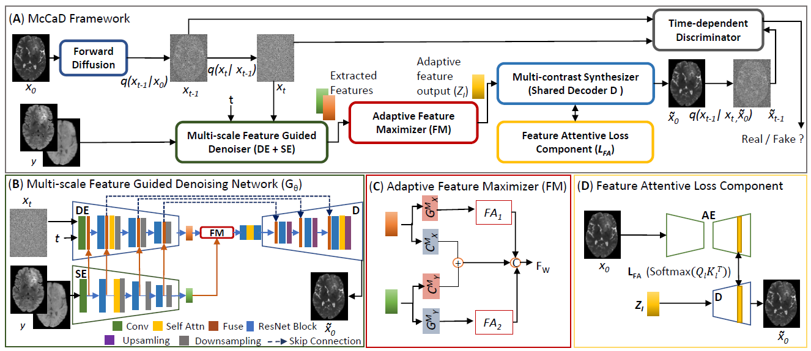

# McCaD: Multi-Contrast MRI Conditioned, Adaptive Adversarial Diffusion Model for Accurate Healthy and Tumor Brain MRI Synthesis
This repo contains the official Pytorch implementation for [McCaD](https://arxiv.org/abs/2409.00585).



Network architecture of McCaD. **A**: Overall Architecture, **B**: Muti-scale Feature Guided Denosing Network, **C**: Adaptive Feature Maximizer, **D**: Feature Attentive Loss.

**Environment**
Please prepare an environment with python>=3.8, and then run the command "pip install -r requirements.txt" for the dependencies.

**Data Preparation**
For experiments, we used two datasets:
  * Tumor Dataset : [BRaTS Dataset](http://braintumorsegmentation.org/)
  * Healthy Dataset
    
Dataset structure
```
data/
├── BRATS/
│   ├── train/
│   │   ├── T1.mat
│   │   └── T2.mat
│   │   └── FLAIR.mat
│   ├── test/
│   │   ├── T1.mat
│   │   └── T2.mat
│   │   └── FLAIR.mat
│   ├── val/
│   │   ├── T1.mat
│   │   └── T2.mat
│   │   └── FLAIR.mat

```

Use [converter.py](converter.py) to convert 3D MRI data to 2D slices and save as .mat

**Train Autoencoder**
```
#update input_path and output_path in train_autoencoder.py

python train_autoencoder.py --image_size 256 --exp exp_autoencoder --num_channels 1 --num_channels_dae 64 --ch_mult 1 1 2 2 4 4 --num_timesteps 4 --num_res_blocks 2 --batch_size 1 --num_epoch 40 --ngf 64 --embedding_type positional --ema_decay 0.999 --r1_gamma 1. --z_emb_dim 256 --lr_d 1e-4 --lr_g 1.6e-4 --lazy_reg 10 --num_process_per_node 1 
```

**Train McCaD**
```
#update input_path, output_path and the autoencoder checkpoint path in train_mccad.py

python train_mccad.py --image_size 256 --exp exp_brats_flair --num_channels 1 --num_channels_dae 64 --ch_mult 1 1 2 2 4 4 --num_timesteps 4 --num_res_blocks 2 --batch_size 1 --num_epoch 50 --ngf 64 --embedding_type positional --ema_decay 0.999 --r1_gamma 1. --z_emb_dim 256 --lr_d 1e-4 --lr_g 1.6e-4 --lazy_reg 10 --num_process_per_node 1
```

**Test McCaD**
```
#update input_path and output_path in below cmd accordingly

python test_mccad.py --image_size 256 --exp exp_brats_flair --num_channels 1 --num_channels_dae 64 --ch_mult 1 1 2 2 4 4 --num_timesteps 4 --num_res_blocks 2 --batch_size 1 --embedding_type positional  --z_emb_dim 256 --contrast1 T1  --contrast2 T2 --which_epoch 50 --gpu_chose 0 --input_path '/data/BRATS/' --output_path '/results'
```

**Acknowledgements**
This repository makes liberal use of code from [Tackling the Generative Learning Trilemma](https://github.com/NVlabs/denoising-diffusion-gan)


